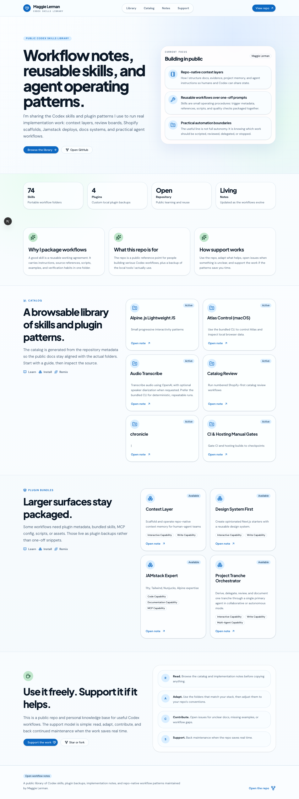
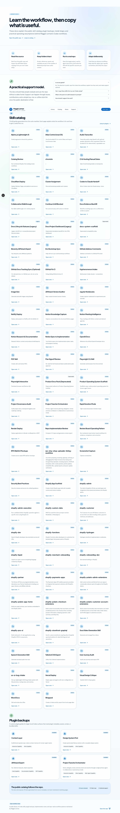
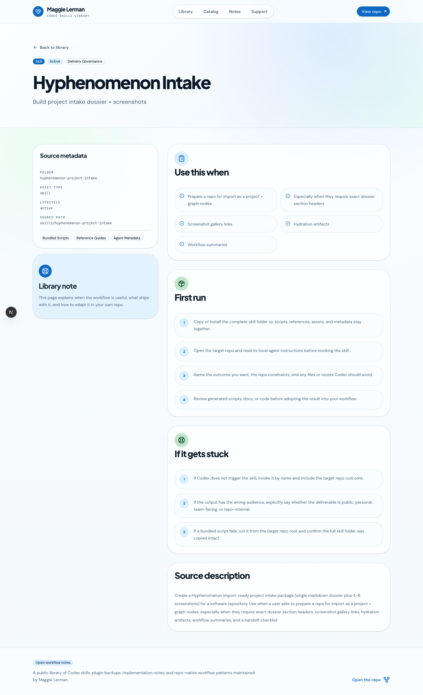
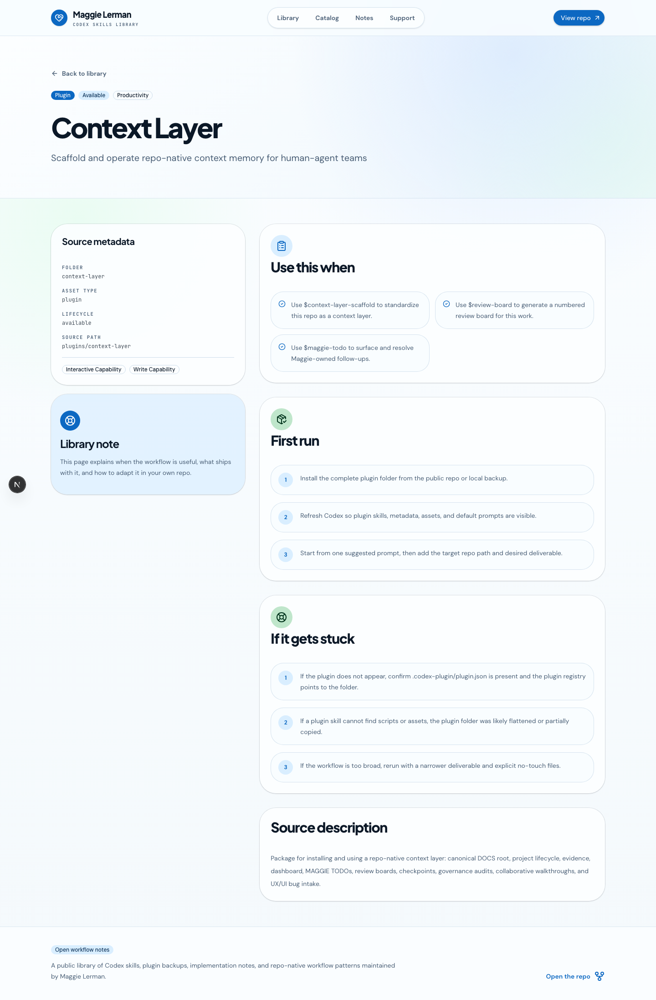

# Project Intake - Codex Skills Library

**Project Name:** Codex Skills Library  
**Repository:** [https://github.com/maggielerman/codex-skills](https://github.com/maggielerman/codex-skills)  
**Live URL(s):** Local review captured at `http://localhost:3030`; public docs deployment URL is not recorded in the repo.  
**Source Repo Path:** `/Users/maggielerman/Github/codex-skills`

## 1) Executive Summary
Codex Skills Library is the durable source repository for Maggie Lerman's custom Codex skills, custom local plugin backups, generated skill catalogs, and the public docs site that explains the workflows. The repo turns local agent behavior into portable, inspectable artifacts: each skill folder carries trigger metadata, instructions, references, scripts, examples, assets, and validation expectations, while the catalog tooling keeps the public docs aligned with the suite allowlist.

## 2) Project Type and Domain
- **Project type:** Program / tooling library.
- **Domains:** AI workflows, developer tools, documentation systems, agent operations, repo-native context.
- **Primary users:** Maggie Lerman as operator/maintainer; future Codex users who inspect, copy, adapt, or contribute skill workflows; agents working inside repos that need reusable operating procedures.
- **Project posture:** Public-learning-oriented repository with all rights reserved until an explicit public license is selected.

## 3) Repository and Live URLs
- **Repository:** [https://github.com/maggielerman/codex-skills](https://github.com/maggielerman/codex-skills)
- **Local docs review:** `http://localhost:3030`
- **Public docs deployment:** Unknown in repo metadata reviewed for this intake.

## 4) Product/User Journey Summary
The user journey starts in the source repository or docs site rather than a hosted application flow. A maintainer or reader opens the repo, browses the generated skill catalog, inspects a skill folder, and copies or adapts the complete folder so scripts, references, assets, and metadata stay together. The docs site gives a public browsing layer with a home page, library docs page, generated skill detail routes, and generated plugin detail routes.

The core product experience is operational: choose a workflow such as project intake, review boards, Shopify scaffolds, Jamstack deployment, context-layer setup, or debugging; invoke the matching skill inside a target repo; then verify the resulting code, docs, artifacts, or browser proof against the local repo's instructions.

## 5) Architecture and Stack Summary
- **Source model:** `skills/` contains portable skill folders; `skills/SUITE_SKILLS.txt` is the curated suite allowlist; `skills/SUITE_METADATA.json` tracks lifecycle labels; `plugins/` backs up selected custom local plugins.
- **Generated catalogs:** `scripts/build_catalog.py` validates suite drift and regenerates `skills/INDEX.md` plus `skills/manifest.json`; `scripts/build_docs_site_catalog.py` regenerates `docs-site/src/lib/catalog.generated.ts`.
- **Docs site:** `docs-site/` is a Next.js 16, React 19, TypeScript, Tailwind, shadcn/base-ui, and lucide-react application for public browsing.
- **Governance docs:** `AGENTS.md`, `README.md`, `CONTRIBUTING.md`, `ROADMAP.md`, `CHANGELOG.md`, and `DOCS/` define repo maintenance expectations, project memory, and evidence conventions.
- **Validation:** The normal validation path is catalog drift checking, generated catalog rebuilds, docs-site catalog regeneration, lint/build where relevant, and targeted script checks.

## 6) Key Workflows and Operational Flows
- **Skill sync and drift review:** Run `./scripts/sync_from_codex_home.sh --check` to compare allowlisted repo skills against local Codex/Agents skill homes, then use `--prune-stale` only when stale repo files should be removed.
- **Catalog validation:** Run `python3 scripts/build_catalog.py --check` before regeneration to detect missing allowlist entries, stale folder state, or generated catalog drift.
- **Catalog regeneration:** Run `python3 scripts/build_catalog.py` and `python3 scripts/build_docs_site_catalog.py` after intended skill/plugin changes so the generated suite and public docs stay in sync.
- **Plugin backup maintenance:** Keep custom plugins self-contained under `plugins/`, preserve `.codex-plugin/plugin.json`, refresh `.agents/plugins/marketplace.json`, and regenerate the docs-site catalog when plugin metadata changes.
- **Public docs review:** Run `npm run dev` or `npm run build` in `docs-site/` to inspect generated catalog pages before treating the public documentation layer as current.

## 7) AI Context: Prompts, Chats, Agent Workflows
This repository is itself an AI-agent operating artifact. Skills encode when an assistant should use a workflow, what files and references to read, what scripts to prefer, and how to verify completion. The local `AGENTS.md` makes the repository's agent contract explicit: treat `skills/` as the primary product, avoid importing hidden/system skills, do not silently rewrite imported skills for tone, preserve third-party notices, and keep plugin backups separate from the curated skill suite.

Current intake evidence also shows a maintenance boundary: the repo worktree already contains unrelated in-progress edits, including an unlisted `hyphenomenon-chat-intake` skill folder. This intake records the repo as-is without resolving that separate catalog drift.

## 8) Supporting Docs and External Resources
- `README.md` explains the repository purpose, layout, sync model, generated catalog, docs site, and support direction.
- `AGENTS.md` defines operating assumptions, required workflows, scope boundaries, quality bar, and docs/evidence conventions for agents.
- `scripts/build_catalog.py` is the key source of truth for catalog validation and generated suite outputs.
- `docs-site/src/app/page.tsx` and `docs-site/src/app/docs/page.tsx` define the public browsing surfaces used for screenshots.
- `plugins/context-layer/.codex-plugin/plugin.json` proves the repo also preserves custom plugin metadata, not only standalone skills.

### Hydration Source Artifacts
| Artifact (relative repo path) | Canonical URL | Type | Why hydrate this into note body |
|---|---|---|---|
| `README.md` | [https://github.com/maggielerman/codex-skills/blob/main/README.md](https://github.com/maggielerman/codex-skills/blob/main/README.md) | markdown | Establishes the project purpose, repo layout, generated catalog contract, sync commands, docs-site role, and support direction. |
| `AGENTS.md` | [https://github.com/maggielerman/codex-skills/blob/main/AGENTS.md](https://github.com/maggielerman/codex-skills/blob/main/AGENTS.md) | markdown | Captures the agent operating contract, required skill/plugin workflows, scope boundaries, quality bar, and docs/evidence expectations. |
| `scripts/build_catalog.py` | [https://github.com/maggielerman/codex-skills/blob/main/scripts/build_catalog.py](https://github.com/maggielerman/codex-skills/blob/main/scripts/build_catalog.py) | text | Documents the executable catalog validation/regeneration system that keeps suite metadata, index, and manifest aligned. |
| `docs-site/README.md` | [https://github.com/maggielerman/codex-skills/blob/main/docs-site/README.md](https://github.com/maggielerman/codex-skills/blob/main/docs-site/README.md) | markdown | Explains the public docs-site intent, local development commands, generated catalog relationship, and support model. |
| `plugins/context-layer/.codex-plugin/plugin.json` | [https://github.com/maggielerman/codex-skills/blob/main/plugins/context-layer/.codex-plugin/plugin.json](https://github.com/maggielerman/codex-skills/blob/main/plugins/context-layer/.codex-plugin/plugin.json) | json | Shows how custom local plugin backups are represented as durable repo artifacts. |
| `DOCS/intake/screenshots/01-home.png` | [https://github.com/maggielerman/codex-skills/blob/main/DOCS/intake/screenshots/01-home.png](https://github.com/maggielerman/codex-skills/blob/main/DOCS/intake/screenshots/01-home.png) | image | Preserves visual proof of the docs-site home route captured from the local review server. |

## 9) Screenshot Gallery (with relative links + captions)
1. Home/Landing:  - Public-facing home route for the Codex skills library and workflow notes.
2. Primary Workflow:  - Library docs and generated skill catalog browsing flow.
3. Key Feature:  - Generated skill detail route for the Hyphenomenon project-intake workflow.
4. Admin/Settings Equivalent:  - Generated plugin backup detail route showing larger bundled workflow metadata.

## 10) Candidate Import Nodes and Relationships
- **Project supernode:** `codex-skills-library` / Codex Skills Library.
- **Candidate project record:** skills and plugin library for reusable Codex workflow patterns, documentation systems, local plugin backup, and public catalog browsing.
- **Supporting notes:** README overview, agent operating contract, catalog builder, docs-site README, context-layer plugin metadata, and docs-site screenshot proof.
- **Workflow nodes:** skill sync and catalog regeneration workflow; public docs-site catalog publishing workflow.
- **Data model nodes:** skill suite catalog model; custom plugin backup model; docs-site generated catalog model.
- **Relationships:** project relates to AI workflow infrastructure, context-layer work, Hyphenomenon project-intake skill, RPS Etsy operations skills, docs-system scaffolds, and public working-notes/skills evidence.

## 11) Risks, Gaps, and Unknowns
- Public docs deployment URL was not confirmed from the reviewed repo files; screenshots use the local docs server at `http://localhost:3030`.
- The worktree has unrelated in-progress edits and catalog drift: `python3 scripts/build_catalog.py --check` reports `hyphenomenon-chat-intake` is present in `skills/` but missing from `skills/SUITE_SKILLS.txt`.
- No `.docx` hydration artifact was identified.
- The repository has PDF audit output under `output/pdf/`, but this local-only intake did not hydrate it because the core repo contract is better represented by source docs and scripts.
- License remains intentionally unresolved: the README says all rights remain reserved until a public license is selected.

## 12) Handoff Checklist for Hyphenomenon Import
- [x] Confirm dossier sections complete and source-backed.
- [x] Confirm screenshot files exist in `DOCS/intake/screenshots`.
- [x] Confirm screenshot links render from `DOCS/intake/hyphenomenon-project-intake.md`.
- [x] Confirm unknowns are explicit.
- [x] Run Hyphenomenon extraction and validation against this dossier.
- [x] Run local-only dry-run and apply against the local Hyphenomenon knowledge backbone.
- [ ] Do not apply to production unless a future operator checkpoint explicitly approves production mutation.
